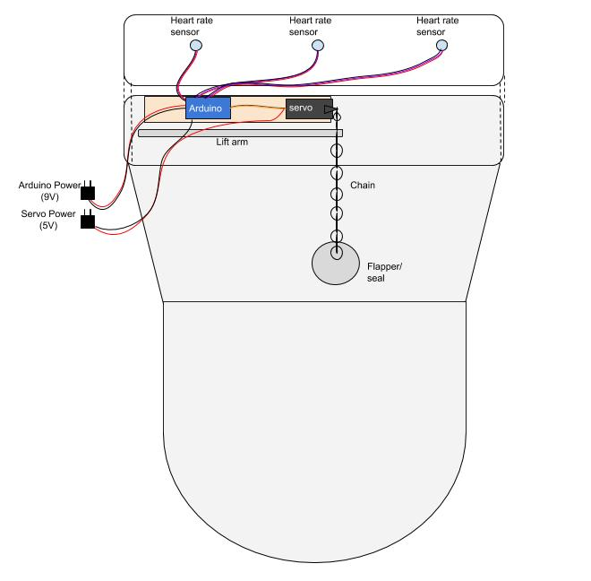
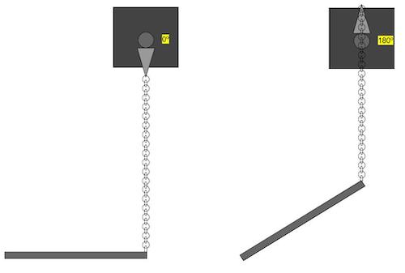
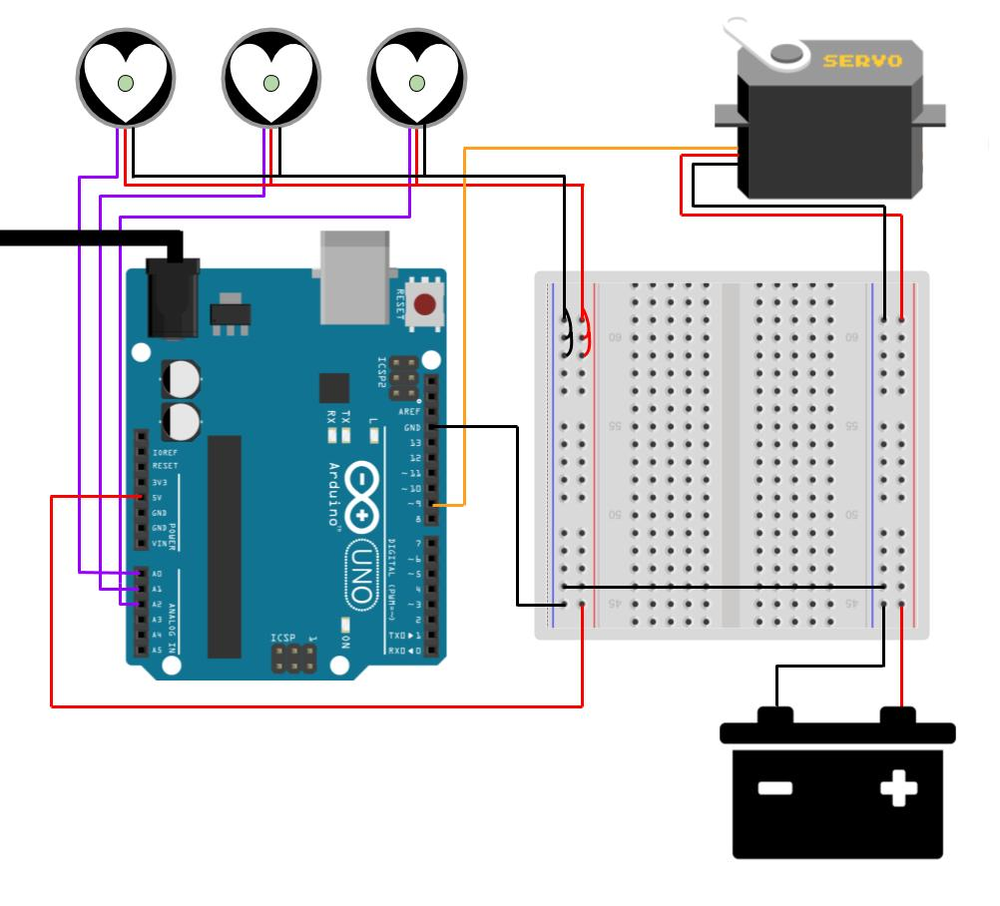

# Heart rate activated toilet flusher
Electronics and software created by Annie Kelly ([personal website](http://rustynymph.com) / [academic website](http://anniekelly.me)) in collaboration with performance artist [Michelle Ellsworth](http://www.michelleellsworth.com/).

This project encourages people to collaborate to flush a toilet using their heart rates. When the 3 pulse sensors detect heart rates that average within a certain threshold, the servo pulls up on the toilet chain therefore flushing the toilet.

## Hardware  

* Arduino Uno  
* 1 [Servo (Generic High Torque)](https://www.sparkfun.com/products/11965)
* 3 [Pulse Sensors](https://pulsesensor.com/)

## Software  
Uses the Arduino [Servo](https://www.arduino.cc/en/reference/servo) and [PulseSensorPlayground](https://github.com/WorldFamousElectronics/PulseSensorPlayground) libraries.

#### Files
* [heartflush.ino](./heartflush.ino) is the main Arduino project file for the pulse sensing and toilet flushing  
* [flushtest_onstart.ino](./flushtest_onstart.ino) is for testing the flushing only, it will flush the toilet when the Arduino is powered on  

## Project diagram  
  
  
The Arduino, servo, and pulse sensors are currently mounted on a 1"x4"x8" piece of wood that rests on top of the toilet tank. The Arduino is powered by 9V DC and the servo is powered externally with 5V DC. The tip of the servo horn is attached to the top of the toilet chain using some jewelry making chain.  

  

When the servo is in its default position of 0 degrees it does not pull on the toilet chain and arm, when it is flushing it flips to 180 degrees and tugs on the chain and arm, thus pulling up the toilet flapper and allowing the water in the tank to flush.  

## Wiring schematic  

